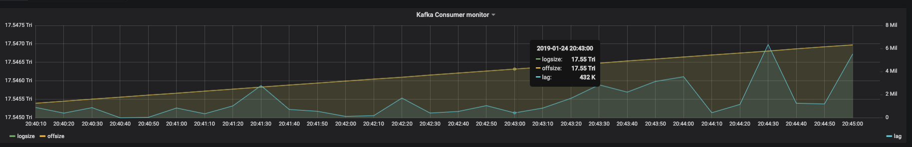

## burrowx - kafka offset lag monitor,stored by influxdb

A simple, lightweight kafka offset monitor, currently metrics stored by influxdb. Motivated by   [Burrow](https://github.com/linkedin/Burrow), but much faster and cleaner and more stable. burrowx is good integration with influxdb and grafana.


#### DemoView


#### Install
```
$ go get github.com/sundy-li/burrowx
$ go build && go install
```

#### Running burrowx
```
//modify server.json file to set influxdb url,then run it
$ $GOPATH/bin/burrowx --config path/to/server.json
```


#### Grafana query

 - logsize template query  : `SELECT "logsize" FROM "consumer_metrics" WHERE "topic" = '$topic' AND "consumer_group" = '$group' AND "cluster" = '$cluster' AND $timeFilter`  
 
 - offsize template query  : `SELECT "offsize" FROM "consumer_metrics" WHERE "topic" = '$topic' AND "consumer_group" = '$group' AND "cluster" = '$cluster' AND $timeFilter`  

 - lag template query  : `SELECT "lag" FROM "consumer_metrics" WHERE "topic" = '$topic' AND "consumer_group" = '$group' AND "cluster" = '$cluster' AND $timeFilter`  


#### Features
 - Light weight and extremely simple to use, metrics are stored in [influxdb](https://github.com/influxdata/influxdb),  and could be easily viewed on [grafana](https://github.com/grafana/grafana)
 - Only support kafka version >= 0.9.X, which stores the consumer offsets in the topic `__consumer_offsets`,if you are using kafka 0.8.X, try my previous repo `https://github.com/shunfei/Dcmonitor`
 - Base on topic,partitions of a topic are merged into topic
